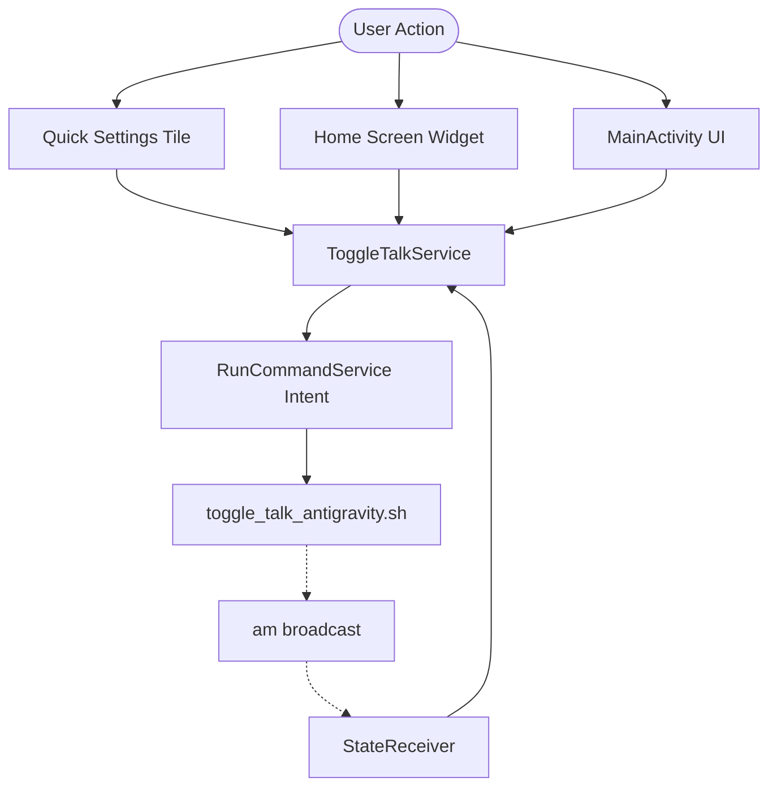

# ToggleTalkAndroid Project Plan (Termux Integration)

A native Android application designed to replicate and extend the single-turn Speech-to-Speech loop from the Termux-based `toggle-talk-antigravity` project. This document serves as the technical blueprint and development roadmap for building the native app.

## 1. Project Goal
Replicate the custom Speech-to-Speech interaction loop inside a native Android application. Instead of calling the Gemini API directly from the Android app, the app acts as a premium frontend that triggers the Termux `toggle_talk_antigravity.sh` script via Termux's secure `com.termux.RUN_COMMAND` intent. State updates are broadcasted back from Termux to keep the Android UI, Quick Settings Tile, and Homescreen Widget in perfect sync.

---

## 2. Core Functional Requirements
- **Single-Trigger Toggle Interaction**:
  - **Click 1 (Idle -> Recording)**: Brief vibration feedback, runs the Termux script via `RUN_COMMAND` to open the microphone and begin recording.
  - **Click 2 (Recording -> Thinking)**: Stops recording, triggering the transcript process and submitting the prompt to the Antigravity agent CLI.
  - **Click 3 (Thinking/Speaking -> Idle)**: Aborts active process, kills the Termux background driver process, stops TTS playback, and resets to idle.
- **Accessibility & Triggers**:
  - Main App Button (Aesthetic, animated UI with pulsing, glowing, and rotation effects).
  - Quick Settings Tile (Accessible from the notification shade anywhere on Android).
  - Homescreen Widget (One-tap home widget trigger).
- **Background Execution**: Supported by a persistent Android Foreground Service that handles intent broadcasts and coordinates system state updates.
- **State Synchronization**: Custom broadcast intents from Termux back to the Android app (`com.toggletalk.android.STATE_UPDATE`) synchronize states (IDLE, RECORDING, THINKING, SPEAKING) and pass transcription/response texts.

---

## 3. Recommended Architecture & Tech Stack
- **Language & Platform**: Java with Android SDK, minimum SDK 26 (Android 8.0).
- **UI Framework**: Native Android XML Views with custom drawable shapes (gradients, glassmorphism) and View-based dynamic animations (ObjectAnimator, ValueAnimator).
- **State Management**: Android `ToggleTalkService` (Foreground Service) acting as the single source of truth for app states:
  - `IDLE`: App is dormant.
  - `RECORDING`: Microphone is active, capturing audio (handled in Termux).
  - `THINKING`: Audio is transcribing / Antigravity CLI is processing in Termux.
  - `SPEAKING`: Kokoro TTS engine is outputting audio in Termux.
- **Termux Command Execution**:
  - Service: `com.termux/com.termux.app.RunCommandService`
  - Action: `com.termux.RUN_COMMAND`
  - Permission: `com.termux.permission.RUN_COMMAND`
  - Target script: `~/ToggleTalkAndroid/toggle_talk_antigravity.sh`

---

## 4. Key Android Components

### A. `ToggleTalkService` (Foreground Service)
- Runs in the background and promotes itself to a foreground service with a persistent notification.
- Listens to broadcasts from the Termux script (`com.toggletalk.android.STATE_UPDATE`).
- Synchronizes the current state across the UI, Quick Settings Tile, and App Widget.
- Fires `RUN_COMMAND` intents to Termux's `RunCommandService` to toggle execution.

### B. `MainActivity`
- Displays a premium glassmorphic dark-themed layout.
- Animates the central mic button (pulsing rings, rotation, glowing halo) depending on the state.
- Shows scrollable real-time transcripts and responses.
- Provides a switch to toggle "Continue Session" (enables `-c` flag for Termux scripts).

### C. `ToggleTileService` & `ToggleWidgetProvider`
- Provide system-level accessibility entry points.
- Query and show current states.
- Delegate actions to `ToggleTalkService`.

---

## 5. Development Roadmap & Milestones

### Milestone 1: Base Application & Project Setup
- Copy configuration files (`build.gradle`, `gradle.properties`, `settings.gradle`, `local.properties`).
- Define permissions and queries in `AndroidManifest.xml`.
- Implement `ToggleTalkService` foreground service and the `BroadcastReceiver`.

### Milestone 2: Termux Script Update
- Modify `~/toggle-talk-antigravity/toggle_talk_antigravity.sh` to send `am broadcast` state updates.
- Test manual triggering of state changes from Termux to the app.

### Milestone 3: Command Integration via Intent
- Implement the `RUN_COMMAND` trigger inside `ToggleTalkService`.
- Implement toggle behavior (start, stop recording, cancel execution).
- Test manual permissions grant and verify that the app successfully invokes the Termux script.

### Milestone 4: Premium UI Development & Animation
- Design the XML Layout using modern aesthetics (indigo-violet background gradient, glassmorphic card, rounded controls).
- Code dynamic custom animators for button states (ripple scaling, circular progress spinning, glowing outline).
- Link logs to the UI scroll view.

### Milestone 5: Accessibility Components
- Implement the Quick Settings Tile service (`ToggleTileService`).
- Implement the App Widget provider (`ToggleWidgetProvider`).
- Sync all states dynamically.

### Milestone 6: Verification & Hand-off
- Perform end-to-end user tests and write the walkthrough.
